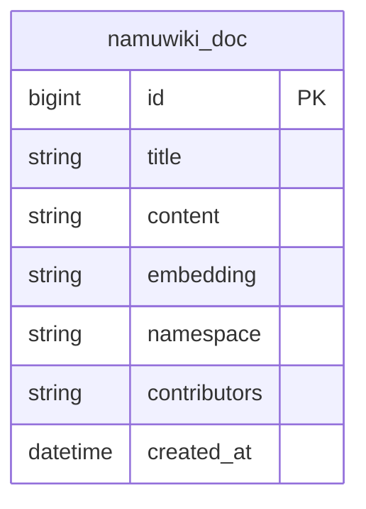
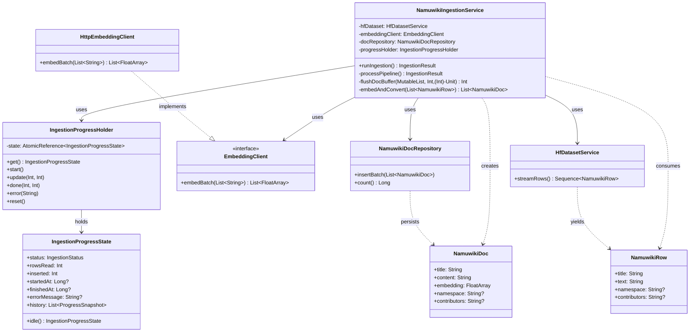
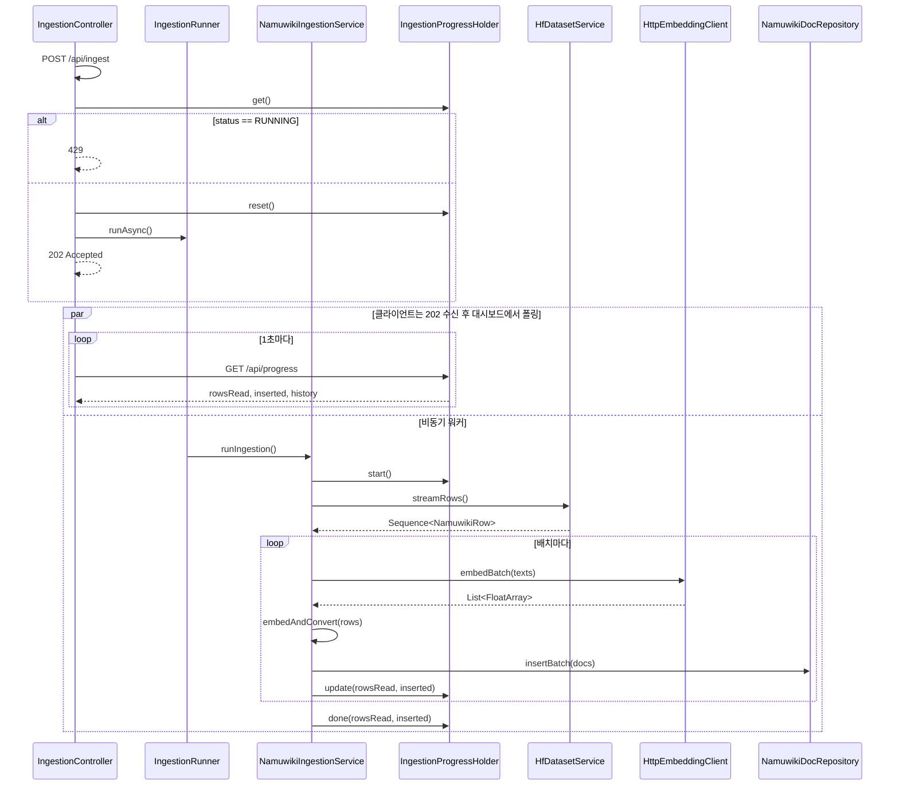
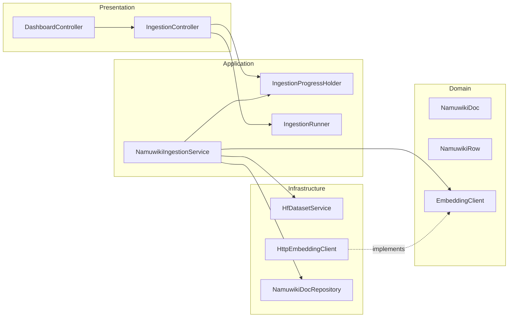

# NamuWiki Ingestion


<br/>
Kotlin + Spring Boot 기반 **나무위키 데이터셋** 적재 서비스입니다. <br/>
Hugging Face의 `heegyu/namuwiki` 데이터를 받아 임베딩을 생성한 뒤 PostgreSQL **pgvector**에 저장하며, Thymeleaf 대시보드에서 실시간 진행 상황을 확인할 수 있습니다.<br/>

<br/>

---

## 프로젝트 소개

| 항목            | 설명                                                                                               |
| --------------- | -------------------------------------------------------------------------------------------------- |
| **목적**        | 나무위키 문서를 벡터 DB에 적재해 RAG·시맨틱 검색 등에 활용                                         |
| **데이터 소스** | Hugging Face [heegyu/namuwiki](https://huggingface.co/datasets/heegyu/namuwiki) (train 약 867k 행) |
| **저장소**      | PostgreSQL + pgvector (벡터 유사도 검색용)                                                         |
| **기술 스택**   | Kotlin 2.2, Spring Boot 4.0, Thymeleaf, JDBC, OkHttp, Parquet, Chart.js, jQuery                    |

**주요 기능**

- Hugging Face datasets-server API로 Parquet URL 조회 후 스트리밍 다운로드
- 배치 단위 임베딩 API 호출 및 pgvector 배치 INSERT
- 비동기 ingestion + 실시간 진행률·차트 대시보드 (Thymeleaf + jQuery + Chart.js)
- 대시보드에서 임베딩 서버 연결 상태 확인 (`/api/embedding-health`)
- **embedding-server**: 동봉된 FastAPI 임베딩 서버(sentence-transformers, 384차원)로 로컬에서 바로 실행 가능

---

## 패키지 구조 (상세)

```
namuwikingestion/
├── build.gradle.kts
├── settings.gradle.kts
├── gradle/
│   └── wrapper/
├── src/main/
│   ├── kotlin/com/sleekydz86/namuwikingestion/
│   │   ├── NamuwikingestionApplication.kt             # Spring Boot 엔트리 (Windows: hadoop.home.dir, winutils 자동 다운로드)
│   │   ├── global/config/                            # AsyncConfig, EmbeddingConfig, NamuwikiIngestionConfig, SchemaInitializer
│   │   ├── domain/                                   # NamuwikiDoc, NamuwikiRow, port/EmbeddingClient
│   │   ├── application/                              # IngestionProgress, IngestionProgressHolder, IngestionRunner, NamuwikiIngestionService
│   │   ├── presentation/                             # DashboardController, IngestionController
│   │   └── infrastructure/
│   │       ├── huggingface/HfDatasetService.kt      # HF Parquet URL 조회, 다운로드, 행 스트리밍
│   │       ├── embedding/
│   │       │   ├── HttpEmbeddingClient.kt            # EmbeddingClient 구현 (HTTP POST)
│   │       │   └── EmbeddingHealthCheck.kt          # 임베딩 서버 /health 확인
│   │       ├── parquet/LocalInputFile.kt             # 로컬 Parquet 파일 읽기
│   │       └── persistence/NamuwikiDocRepository.kt # pgvector 배치 INSERT, count
│   └── resources/
│       ├── application.yml
│       ├── schema.sql
│       └── templates/dashboard.html
├── embedding-server/                                 # FastAPI 임베딩 API (선택)
│   ├── main.py                                       # POST /embed, GET /health (sentence-transformers 384차원)
│   ├── requirements.txt
│   ├── run.ps1                                       # Windows: 가상환경 생성·실행 한 번에
│   └── README.md
├── scripts/
│   └── setup-winutils.ps1                            # Windows: winutils.exe 수동 설치 (자동 다운로드 실패 시)
└── README.md
```

**패키지별 역할**

| 패키지                            | 역할                                                                                     |
| --------------------------------- | ---------------------------------------------------------------------------------------- |
| `com.sleekydz86.namuwikingestion` | 루트·엔트리 (Windows 시 hadoop.home.dir, winutils 자동 다운로드)                         |
| `global.config`                   | Spring 설정·ConfigurationProperties (embedding, dataset, insert, async)                  |
| `domain`                          | 도메인 모델(NamuwikiDoc, NamuwikiRow) 및 포트(EmbeddingClient)                           |
| `application`                     | 유스케이스·진행 상태(NamuwikiIngestionService, IngestionProgressHolder, IngestionRunner) |
| `presentation`                    | REST API·Thymeleaf 컨트롤러                                                              |
| `infrastructure.huggingface`      | Hugging Face datasets-server·Parquet 읽기                                                |
| `infrastructure.embedding`        | 외부 임베딩 HTTP 클라이언트, 임베딩 서버 health 확인                                     |
| `infrastructure.persistence`      | PostgreSQL·pgvector 저장소                                                               |

---

## ERD (Entity Relationship Diagram)

단일 테이블 `namuwiki_doc`으로 문서와 벡터를 저장합니다. pgvector 확장의 `vector(384)` 타입을 사용합니다.



**테이블 설명**

| 컬럼           | 타입        | 설명                                       |
| -------------- | ----------- | ------------------------------------------ |
| `id`           | BIGSERIAL   | PK                                         |
| `title`        | TEXT        | 나무위키 문서 제목                         |
| `content`      | TEXT        | 본문                                       |
| `embedding`    | vector(384) | 임베딩 벡터 (차원은 모델에 맞게 변경 가능) |
| `namespace`    | TEXT        | 원본 데이터 namespace                      |
| `contributors` | TEXT        | 기여자 정보                                |
| `created_at`   | TIMESTAMPTZ | 레코드 생성 시각                           |

**인덱스**

- `namuwiki_doc_embedding_idx`: `ivfflat` (vector_cosine_ops), 코사인 유사도 검색용

---

## UML

### 1. 클래스 다이어그램 (핵심 클래스)



### 2. 시퀀스 다이어그램 (Ingestion 파이프라인)



### 3. 컴포넌트 다이어그램



**의존성 방향**: Presentation → Application → Domain ← Infrastructure (포트·어댑터 구조).

---

## 요구 사항

- Java 21+
- PostgreSQL + pgvector (예: 5433 포트)
- **임베딩 API**: 동봉된 `embedding-server`(FastAPI)를 쓰거나, 규격에 맞는 외부 API URL 설정

---

---

## 설정 (application.yml / 환경 변수)

| 설정             | 환경 변수                         | 설명                                                           |
| ---------------- | --------------------------------- | -------------------------------------------------------------- |
| DB URL           | `SPRING_DATASOURCE_URL`           | 기본: `jdbc:postgresql://localhost:5433/postgres?...`          |
| 임베딩 API URL   | `NAMUWIKI_EMBEDDING_ENDPOINT_URL` | 기본: `http://localhost:8000/embed` (embedding-server 사용 시) |
| 임베딩 API 키    | `NAMUWIKI_EMBEDDING_API_KEY`      | 선택                                                           |
| 테스트용 행 제한 | `NAMUWIKI_LIMIT`                  | 0이면 전체(867k), 양수면 해당 행만 처리                        |
| 임베딩 배치 크기 | `EMBEDDING_BATCH_SIZE`            | 기본 32                                                        |
| INSERT 배치 크기 | `INSERT_BATCH_SIZE`               | 기본 100                                                       |

**임베딩 API 규격**

- 요청: `POST {endpoint-url}`
  - Body: `{ "texts": ["문장1", "문장2", ...] }`
  - `Content-Type: application/json`
- 응답: `{ "embeddings": [[f1,f2,...], ...] }`
  - `texts` 순서와 동일한 개수의 float 배열, 차원은 DB `vector(384)`와 일치

---

## API 및 화면

| 메서드 | 경로                    | 설명                                                         |
| ------ | ----------------------- | ------------------------------------------------------------ |
| GET    | `/`                     | Thymeleaf 대시보드 (실시간 통계·차트, 임베딩 서버 연결 상태) |
| POST   | `/api/ingest`           | Ingestion 비동기 시작 (이미 실행 중이면 429)                 |
| GET    | `/api/progress`         | 진행 상태 및 history (차트용)                                |
| GET    | `/api/stats`            | DB 적재 문서 수                                              |
| GET    | `/api/embedding-health` | 임베딩 서버 연결 여부 및 health URL (대시보드에서 사용)      |

데이터셋이 크므로(약 3GB parquet, 867k 행) 첫 실행 시 디스크·네트워크·임베딩 API 시간을 고려하세요.

출처: [pgvector와 textsearch_ko를 결합한 한국어 하이브리드 검색 환경](https://velog.io/@sleekydevzero86/postgresql-korean-fts-pgvector)
